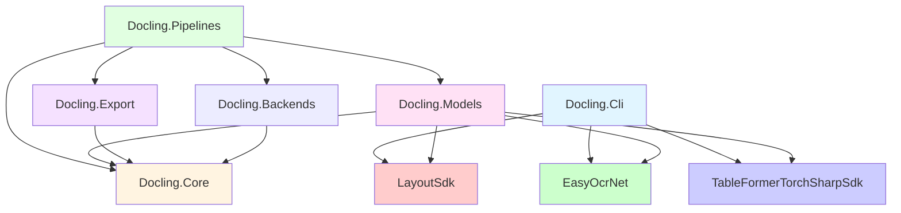

# DoclingNet - Diagramma Architettura Completo

**Versione:** 1.0
**Data:** 2025-10-26

---

## 📊 Vista Generale Progetti

```
DoclingNet Solution
│
├── 🎯 APPLICAZIONI
│   └── Docling.Cli                    [Applicazione console]
│
├── 📦 CORE LIBRARY
│   ├── Docling.Core                   [Modelli documento]
│   ├── Docling.Models                 [Modelli AI/ML]
│   ├── Docling.Pipelines              [Pipeline orchestration]
│   ├── Docling.Export                 [Export (Markdown, etc.)]
│   └── Docling.Backends               [Storage & PDF backends]
│
├── 🔧 TOOLING
│   └── Docling.Tooling                [Build tools]
│
└── 🤖 AI/ML SUBMODULES (External)
    ├── LayoutSdk                       [Layout detection - Heron ONNX]
    ├── EasyOcrNet                      [OCR - CRAFT + CRNN]
    └── TableFormerTorchSharpSdk        [Table structure - TorchSharp]
```

---

## 🏗️ Dipendenze tra Progetti



---

## 📦 Docling.Core - Modelli Documento

### Gerarchia Classi Principali

```
📁 Docling.Core
│
├── 📂 Documents/
│   │
│   ├── DoclingDocument                    [ROOT - Documento completo]
│   │   ├── string Id
│   │   ├── string SourceId
│   │   ├── DateTimeOffset CreatedAt
│   │   ├── IReadOnlyList<PageReference> Pages
│   │   ├── IReadOnlyList<DocItem> Items  ← COLLEZIONE PRINCIPALE
│   │   └── IReadOnlyDictionary<string, string> Properties
│   │
│   ├── DocItem (abstract base)           [BASE per tutti gli elementi]
│   │   ├── string Label
│   │   ├── DocItemKind Kind              ← ENUM
│   │   ├── DocItemProvenance Provenance  ← Posizione nella pagina
│   │   └── IReadOnlyDictionary<string, object?> Metadata
│   │
│   ├── ParagraphItem : DocItem           [Testo/Paragrafo]
│   │   ├── string Text
│   │   └── IEnumerable<string>? Markers
│   │
│   ├── TableItem : DocItem               [Tabella]
│   │   ├── int RowCount
│   │   ├── int ColumnCount
│   │   └── IReadOnlyList<TableCellItem> Cells
│   │
│   ├── TableCellItem : DocItem           [Cella tabella]
│   │   ├── int RowIndex, ColumnIndex
│   │   ├── int RowSpan, ColumnSpan
│   │   ├── string? Text
│   │   └── IReadOnlyList<DocItem>? Content
│   │
│   ├── PictureItem : DocItem             [Immagine/Figura]
│   │   ├── ImageRef? Image
│   │   └── string? Caption
│   │
│   ├── CaptionItem : DocItem             [Didascalia]
│   │   └── string Text
│   │
│   ├── DocItemKind (enum)                [Tipi elementi]
│   │   ├── Text, Paragraph
│   │   ├── Title, SectionHeader
│   │   ├── Table, Picture, Caption
│   │   ├── PageHeader, PageFooter
│   │   ├── ListItem, Code, Formula
│   │   └── ...
│   │
│   ├── DocItemProvenance                 [Metadati posizione]
│   │   ├── int PageNumber
│   │   ├── BoundingBox BoundingBox
│   │   └── (int Start, int End)? CharSpan
│   │
│   └── DoclingDocumentBuilder            [Builder pattern]
│       └── Build() → DoclingDocument
│
├── 📂 Geometry/
│   ├── BoundingBox                       [Rettangolo]
│   │   ├── double Left, Top, Right, Bottom
│   │   ├── double Width, Height, Area
│   │   └── IntersectionArea(other) → double
│   │
│   ├── Point2D                           [Punto 2D]
│   │   └── double X, Y
│   │
│   ├── Polygon                           [Poligono]
│   │   └── IReadOnlyList<Point2D> Points
│   │
│   └── PageSize                          [Dimensioni pagina]
│       └── double Width, Height, Dpi
│
└── 📂 Primitives/
    ├── PageReference                     [Riferimento pagina]
    │   ├── int PageNumber
    │   └── PageSize Size
    │
    └── ImageRef                          [Riferimento immagine]
        ├── string Uri
        └── string? MimeType
```

### Relazioni Chiave

```
DoclingDocument "1" *-- "*" DocItem : contains
DoclingDocument "1" *-- "*" PageReference : has pages
DocItem <|-- ParagraphItem
DocItem <|-- TableItem
DocItem <|-- PictureItem
DocItem <|-- CaptionItem
DocItem <|-- TableCellItem
DocItem "1" *-- "1" DocItemProvenance : has location
TableItem "1" *-- "*" TableCellItem : contains cells
DocItemProvenance "1" *-- "1" BoundingBox : has bbox
PictureItem "1" *-- "0..1" ImageRef : references
```

---

## 🎭 Docling.Models - Adattatori AI/ML

### Struttura Modelli Intermedi

```
📁 Docling.Models
│
├── 📂 Layout/
│   │
│   ├── ILayoutDetectionService          [INTERFACE]
│   │   └── DetectAsync(request) → IReadOnlyList<LayoutItem>
│   │
│   ├── LayoutSdkDetectionService : ILayoutDetectionService
│   │   ├── ILayoutSdkRunner _runner
│   │   └── DetectAsync() → List<LayoutItem>
│   │
│   ├── LayoutItem (record)              [OUTPUT Layout SDK]
│   │   ├── PageReference Page
│   │   ├── BoundingBox BoundingBox
│   │   ├── LayoutItemKind Kind          ← Text | Table | Figure
│   │   └── IReadOnlyList<Polygon> Polygons
│   │
│   ├── LayoutItemKind (enum)
│   │   ├── Text
│   │   ├── Table
│   │   └── Figure
│   │
│   └── LayoutSdkRunner                  [WRAPPER per LayoutSdk]
│       └── InferAsync() → LayoutSdkInferenceResult
│
├── 📂 Ocr/
│   │
│   ├── IOcrService                      [INTERFACE]
│   │   └── RecognizeAsync(request) → IAsyncEnumerable<OcrLine>
│   │
│   ├── EasyOcrService : IOcrService
│   │   ├── OcrEngine _engine           ← EasyOcrNet
│   │   └── RecognizeAsync() → IAsyncEnumerable<OcrLine>
│   │
│   ├── OcrBlockResult                   [OUTPUT OCR aggregato]
│   │   ├── PageReference Page
│   │   ├── BoundingBox BoundingBox
│   │   ├── OcrRegionKind Kind          ← LayoutBlock | TableCell | FullPage
│   │   └── IReadOnlyList<OcrLine> Lines
│   │
│   ├── OcrLine                          [Singola riga OCR]
│   │   ├── string Text
│   │   ├── BoundingBox BoundingBox
│   │   ├── float Confidence
│   │   └── IReadOnlyList<OcrWord> Words
│   │
│   ├── OcrWord                          [Singola parola]
│   │   ├── string Text
│   │   ├── BoundingBox BoundingBox
│   │   └── float Confidence
│   │
│   └── OcrServiceFactory                [FACTORY]
│       └── Create(options) → IOcrService
│
└── 📂 Tables/
    │
    ├── ITableStructureService           [INTERFACE]
    │   └── InferAsync(request) → IReadOnlyList<TableStructure>
    │
    ├── TableFormerTableStructureService : ITableStructureService
    │   ├── TableFormerNeuralModel _model  ← TableFormer
    │   └── InferAsync() → List<TableStructure>
    │
    ├── TableStructure                   [OUTPUT TableFormer]
    │   ├── PageReference Page
    │   ├── BoundingBox BoundingBox
    │   ├── int RowCount, ColumnCount
    │   └── IReadOnlyList<TableCell> Cells
    │
    └── TableCell                        [Cella singola]
        ├── BoundingBox BoundingBox
        ├── int RowSpan, ColumnSpan
        ├── bool IsHeader
        └── string? Text
```

### Mapping: AI Output → Docling Models

```
┌─────────────────┐         ┌──────────────────┐         ┌─────────────────┐
│  LayoutSdk      │────────→│  LayoutItem      │────────→│  DocItem        │
│  BoundingBox    │ convert │  (Models)        │ assemble│  (Core)         │
└─────────────────┘         └──────────────────┘         └─────────────────┘

┌─────────────────┐         ┌──────────────────┐
│  EasyOcrNet     │────────→│  OcrBlockResult  │────────→ Testo nei DocItem
│  OcrResult      │ convert │  (Models)        │ merge
└─────────────────┘         └──────────────────┘

┌─────────────────┐         ┌──────────────────┐         ┌─────────────────┐
│  TableFormer    │────────→│  TableStructure  │────────→│  TableItem      │
│  TfResponse     │ convert │  (Models)        │ assemble│  (Core)         │
└─────────────────┘         └──────────────────┘         └─────────────────┘
```

---

## 🔄 Docling.Pipelines - Orchestrazione

### Architettura Pipeline

```
📁 Docling.Pipelines
│
├── 📂 Abstractions/
│   │
│   ├── IPipelineStage                   [INTERFACE per stage]
│   │   ├── string Name
│   │   └── ExecuteAsync(context, ct) → Task
│   │
│   ├── PipelineContext                  [SHARED STATE]
│   │   ├── Dictionary<string, object> _storage
│   │   ├── Get<T>(key) → T
│   │   ├── Set<T>(key, value)
│   │   └── TryGet<T>(key, out value) → bool
│   │
│   ├── PipelineContextKeys              [COSTANTI chiavi]
│   │   ├── const string LayoutItems
│   │   ├── const string OcrResults
│   │   ├── const string TableStructures
│   │   ├── const string Document
│   │   └── ...
│   │
│   └── IPipelineObserver                [Telemetria]
│       ├── OnStageStartingAsync()
│       └── OnStageCompletedAsync()
│
├── 📂 Internal/
│   │
│   ├── ConvertPipeline                  [ORCHESTRATORE PRINCIPALE]
│   │   ├── IReadOnlyList<IPipelineStage> _stages
│   │   ├── IReadOnlyList<IPipelineObserver> _observers
│   │   └── ExecuteAsync(context) → Task
│   │       │
│   │       ├── for each stage:
│   │       │   ├── Notify observers (starting)
│   │       │   ├── stage.ExecuteAsync(context)
│   │       │   └── Notify observers (completed)
│   │       └── return
│   │
│   └── ConvertPipelineBuilder           [BUILDER]
│       ├── AddStage(stage)
│       ├── AddObserver(observer)
│       └── Build() → ConvertPipeline
│
├── 📂 Stages/ (implementazioni IPipelineStage)
│   │
│   ├── PagePreprocessingStage           [STAGE 1: Caricamento]
│   │   └── ExecuteAsync()
│   │       ├── Legge immagine da disco
│   │       ├── context.Set("preprocessed_image", bitmap)
│   │       └── context.Set("PreprocessingCompleted", true)
│   │
│   ├── LayoutAnalysisStage              [STAGE 2: Layout]
│   │   ├── ILayoutDetectionService _service
│   │   └── ExecuteAsync()
│   │       ├── image = context.Get("preprocessed_image")
│   │       ├── layout = _service.DetectAsync(image)
│   │       ├── context.Set("LayoutItems", layout)
│   │       └── context.Set("LayoutAnalysisCompleted", true)
│   │
│   ├── OcrStage                         [STAGE 3: OCR]
│   │   ├── IOcrServiceFactory _factory
│   │   └── ExecuteAsync()
│   │       ├── layoutItems = context.Get("LayoutItems")
│   │       ├── foreach item in layoutItems:
│   │       │   └── ocrResults += _service.RecognizeAsync(item.bbox)
│   │       ├── context.Set("OcrResults", ocrResults)
│   │       └── context.Set("OcrCompleted", true)
│   │
│   ├── TableStructureInferenceStage     [STAGE 4: Tabelle]
│   │   ├── ITableStructureService _service
│   │   └── ExecuteAsync()
│   │       ├── layoutItems = context.Get("LayoutItems")
│   │       ├── tables = layoutItems.Where(x => x.Kind == Table)
│   │       ├── foreach table in tables:
│   │       │   └── structure = _service.InferAsync(table)
│   │       └── context.Set("TableStructures", structures)
│   │
│   ├── PageAssemblyStage                [STAGE 5: Assembly] ⚠️ COMPLESSO!
│   │   └── ExecuteAsync()
│   │       ├── layoutItems = context.Get("LayoutItems")
│   │       ├── ocrResults = context.Get("OcrResults")
│   │       ├── tableStructures = context.Get("TableStructures")
│   │       │
│   │       ├── 1. Assegna OCR text ai layout items (bbox overlap)
│   │       ├── 2. Per ogni LayoutItem:
│   │       │   ├── if Text → ParagraphItem(text from OCR)
│   │       │   ├── if Table → TableItem(structure from TableFormer)
│   │       │   └── if Figure → PictureItem
│   │       │
│   │       ├── 3. DoclingDocument document = Build(items)
│   │       ├── context.Set("Document", document)
│   │       └── context.Set("DocumentAssemblyCompleted", true)
│   │
│   └── MarkdownSerializationStage       [STAGE 6: Export]
│       ├── MarkdownDocSerializer _serializer
│       └── ExecuteAsync()
│           ├── document = context.Get("Document")
│           ├── markdown = _serializer.Serialize(document)
│           ├── context.Set("MarkdownSerializationResult", markdown)
│           └── context.Set("MarkdownSerializationCompleted", true)
│
└── 📂 Options/
    ├── PipelineOptions                  [Config generale]
    ├── LayoutOptions                    [Config layout]
    ├── OcrOptions                       [Config OCR]
    └── TableStructureOptions            [Config tabelle]
```

### Flusso Dati attraverso Pipeline

```
INPUT: Image File
    ↓
┌──────────────────────────────────────┐
│ PipelineContext (shared state)      │
│                                      │
│  PagePreprocessingStage              │
│  ├─→ Set: preprocessed_image         │
│  └─→ Set: PageSequence               │
│       ↓                              │
│  LayoutAnalysisStage                 │
│  ├─→ Get: preprocessed_image         │
│  └─→ Set: LayoutItems [12 items]    │ ← List<LayoutItem>
│       ↓                              │
│  OcrStage                            │
│  ├─→ Get: LayoutItems                │
│  ├─→ Get: preprocessed_image         │
│  └─→ Set: OcrResults [25 blocks]    │ ← List<OcrBlockResult>
│       ↓                              │
│  TableStructureInferenceStage       │
│  ├─→ Get: LayoutItems (tables)      │
│  └─→ Set: TableStructures [1 table] │ ← List<TableStructure>
│       ↓                              │
│  PageAssemblyStage    ⚠️ CRITICO!    │
│  ├─→ Get: LayoutItems                │
│  ├─→ Get: OcrResults                 │
│  ├─→ Get: TableStructures            │
│  │                                   │
│  │  [MERGE LOGIC]                    │
│  │  1. Match OCR → Layout (bbox)    │
│  │  2. Create DocItems               │
│  │  3. Build DoclingDocument         │
│  │                                   │
│  └─→ Set: Document                   │ ← DoclingDocument
│       ↓                              │
│  MarkdownSerializationStage          │
│  ├─→ Get: Document                   │
│  └─→ Set: MarkdownSerializationResult│ ← string (Markdown)
│                                      │
└──────────────────────────────────────┘
    ↓
OUTPUT: Markdown String
```

---

## 📤 Docling.Export - Serializzazione

```
📁 Docling.Export
│
├── 📂 Serialization/
│   │
│   ├── MarkdownDocSerializer            [MAIN SERIALIZER]
│   │   ├── Serialize(document, exports) → MarkdownSerializationResult
│   │   │   │
│   │   │   ├── foreach item in document.Items:
│   │   │   │   ├── switch item.Kind:
│   │   │   │   │   ├── Title → # {text}
│   │   │   │   │   ├── SectionHeader → ## {text}
│   │   │   │   │   ├── Paragraph → {text}\n\n
│   │   │   │   │   ├── Table → RenderTable(tableItem)
│   │   │   │   │   ├── Picture → 
│   │   │   │   │   ├── Caption → _{text}_
│   │   │   │   │   ├── Code → ```\n{text}\n```
│   │   │   │   │   └── ListItem → - {text}
│   │   │   │   └── Append to StringBuilder
│   │   │   └── return markdown string
│   │   │
│   │   └── RenderTable(table) → string
│   │       ├── Build markdown table grid
│   │       ├── | Col1 | Col2 | Col3 |
│   │       ├── |------|------|------|
│   │       ├── | A    | B    | C    |
│   │       └── return table markdown
│   │
│   ├── MarkdownSerializationResult      [OUTPUT]
│   │   ├── string Markdown
│   │   └── IReadOnlyDictionary<string, object> Metadata
│   │
│   └── MarkdownSerializerOptions        [CONFIG]
│       ├── TableFormat (Markdown | HTML)
│       ├── ImageAltTextStrategy
│       └── HeadingStyle
│
└── 📂 Imaging/
    └── ImageExportArtifact              [Immagini esportate]
        ├── string Path
        ├── string MimeType
        └── BoundingBox SourceBoundingBox
```

---

## 🗄️ Docling.Backends - Storage & PDF

```
📁 Docling.Backends
│
├── 📂 Storage/
│   │
│   ├── PageImageStore                   [Gestione immagini pagine]
│   │   ├── Rent(page) → PageImage
│   │   └── Return(pageImage)
│   │
│   └── PageImage                        [Wrapper immagine]
│       ├── SKBitmap Bitmap
│       ├── BoundingBox BoundingBox
│       └── IDisposable
│
└── 📂 Pdf/
    └── PdfBackend                       [Backend PDF (non usato per immagini)]
        └── LoadPage(pageNo) → Page
```

---

## 🎯 Docling.Cli - Applicazione Console

```
📁 Docling.Cli
│
└── Program.cs                           [MAIN - 681 righe] ⚠️ MONOLITICO
    │
    ├── Main(args)                       [Entry point]
    │   ├── Parse arguments
    │   └── Execute workflow
    │
    ├── WORKFLOW ATTUALE (senza pipeline):
    │   │
    │   ├── 1. LoadImage(path) → SKBitmap
    │   │
    │   ├── 2. LayoutDetection
    │   │   ├── LayoutSdk sdk = new LayoutSdk(modelPath)
    │   │   ├── result = sdk.Process(imagePath)
    │   │   └── boxes = result.Boxes  [12 BoundingBox]
    │   │
    │   ├── 3. OCR Extraction
    │   │   ├── ocrEngine = CreateEasyOcrAsync()
    │   │   ├── foreach box in boxes (non-table):
    │   │   │   ├── crop = CropRegion(image, box)
    │   │   │   ├── ocrResults = ocrEngine.ProcessImageAsync(crop)
    │   │   │   └── Save to ocrResultsDict
    │   │   └── Save JSON: dataset/ocr_results/{image}_ocr_results.json
    │   │
    │   ├── 4. Table Processing
    │   │   ├── tables = boxes.Where(b => b.Label == "Table")
    │   │   ├── TableFormer setup (config, predictor, decoder...)
    │   │   ├── foreach table:
    │   │   │   ├── crop = CropRegion(image, table)
    │   │   │   ├── Save PNG: dataset/extracted_tables/{image}_table_{n}.png
    │   │   │   ├── prediction = predictor.Predict(crop)
    │   │   │   └── structure = decoder.Decode(prediction)
    │   │   └── Save JSON: dataset/extracted_tables/table_structure_results.json
    │   │
    │   └── 5. Text Output
    │       ├── Combine OCR results
    │       ├── Sort by Y position
    │       └── Save TXT: dataset/{image}_ocr_text.txt
    │
    └── Helper Methods:
        ├── CreateEasyOcrAsync() → OcrEngine
        ├── ResolveEasyOcrModelDirectory() → string
        ├── CropRegion(bitmap, bbox) → SKBitmap
        └── FindModelPath() → string?
```

### Problema CLI Attuale

```
❌ PROBLEMA:
   CLI chiama direttamente le librerie AI/ML
   → Non usa Docling.Pipelines
   → Non crea DoclingDocument
   → Non produce Markdown
   → Output solo JSON grezzo

✅ SOLUZIONE (da implementare):
   CLI → Pipeline → DoclingDocument → Markdown

   Option A: Refactor CLI per usare Pipeline
   Option B: Bridge JSON → DoclingDocument → Markdown
   Option C: Nuovo CLI che usa Pipeline
```

---

## 🤖 Submodules AI/ML (External)

### LayoutSdk

```
📁 LayoutSdk (submodule)
│
├── LayoutSdk class                      [MAIN CLASS]
│   ├── Process(imagePath, overlay, runtime) → LayoutResult
│   │   ├── Load ONNX model (Heron)
│   │   ├── Preprocess image
│   │   ├── Run inference
│   │   └── Post-process detections
│   └── Dispose()
│
├── LayoutResult                         [OUTPUT]
│   ├── IReadOnlyList<BoundingBox> Boxes
│   └── SKBitmap? Overlay (optional)
│
└── BoundingBox (LayoutSdk.BoundingBox)  [DETECTION]
    ├── float X, Y, Width, Height
    ├── string Label  (Text, Table, Figure, ...)
    └── float Confidence
```

### EasyOcrNet

```
📁 EasyOcrNet (submodule)
│
├── OcrEngine class                      [MAIN CLASS]
│   ├── ProcessImageAsync(bitmap) → List<OcrResult>
│   │   ├── CRAFT detection (trova bboxes testo)
│   │   ├── CRNN recognition (riconosce testo)
│   │   └── Return results
│   └── Dispose()
│
├── OcrResult                            [OUTPUT]
│   ├── string Text
│   ├── BoundingBoxF BoundingBox (MinX, MinY, MaxX, MaxY)
│   └── float Confidence
│
└── OcrReleaseDownloader                 [AUTO-DOWNLOAD]
    └── EnsureModelAsync(path, options) → Task
        └── Download da GitHub releases se mancante
```

### TableFormerTorchSharpSdk

```
📁 TableFormerTorchSharpSdk (submodule)
│
├── TableFormerNeuralModel               [PREDICTOR]
│   ├── Predict(tensorBatch) → TableFormerNeuralPrediction
│   │   ├── Load TorchSharp model
│   │   ├── Run transformer inference
│   │   └── Return raw predictions
│   └── Dispose()
│
├── TableFormerSequenceDecoder           [DECODER]
│   ├── Decode(predictions) → TableFormerSequencePrediction
│   │   └── Decode OTSL sequence to structure
│   └── DecodeAll(...) → List<TableFormerSequencePrediction>
│
├── TableFormerDoclingResponseAssembler  [ASSEMBLER]
│   └── Assemble(matching, sequence) → TableFormerDoclingTablePrediction
│       └── Build final table structure
│
└── TableFormerDoclingTablePrediction    [OUTPUT]
    ├── IReadOnlyList<TableFormerDoclingCellResponse> TfResponses
    └── TableFormerDoclingCellResponse:
        ├── BoundingBox Bbox
        ├── int StartRowIdx, EndRowIdx
        ├── int StartColIdx, EndColIdx
        ├── bool IsColumnHeader, IsRowHeader
        └── string? Text
```

---

## 🔗 Relazioni End-to-End

### Flusso Completo (Ipotetico con Pipeline)

```
USER
  │
  └─→ Docling.Cli
        │
        └─→ ConvertPipeline.ExecuteAsync(context)
              │
              ├─→ PagePreprocessingStage
              │     └─→ SKBitmap (SkiaSharp)
              │
              ├─→ LayoutAnalysisStage
              │     ├─→ LayoutSdkDetectionService
              │     │     └─→ LayoutSdk.Process()
              │     │           └─→ ONNX Runtime (Heron model)
              │     └─→ List<LayoutItem>
              │
              ├─→ OcrStage
              │     ├─→ EasyOcrService
              │     │     └─→ EasyOcrNet.OcrEngine.ProcessImageAsync()
              │     │           ├─→ CRAFT (detection)
              │     │           └─→ CRNN (recognition)
              │     └─→ List<OcrBlockResult>
              │
              ├─→ TableStructureInferenceStage
              │     ├─→ TableFormerTableStructureService
              │     │     └─→ TableFormerNeuralModel.Predict()
              │     │           └─→ TorchSharp (transformer)
              │     └─→ List<TableStructure>
              │
              ├─→ PageAssemblyStage ⚠️ MERGE POINT
              │     ├─→ Merge: LayoutItem + OcrBlockResult + TableStructure
              │     ├─→ DoclingDocumentBuilder.Build()
              │     └─→ DoclingDocument
              │
              └─→ MarkdownSerializationStage
                    ├─→ MarkdownDocSerializer.Serialize()
                    └─→ string (Markdown)
```

### Mapping Tipi Chiave

```
┌─────────────────────────────────────────────────────────────────┐
│                    TYPE MAPPING ACROSS LAYERS                   │
├─────────────────────────────────────────────────────────────────┤
│                                                                 │
│  AI/ML Layer          Models Layer              Core Layer     │
│  ━━━━━━━━━━           ━━━━━━━━━━━━              ━━━━━━━━━      │
│                                                                 │
│  LayoutSdk.           Docling.Models.           Docling.Core.  │
│  BoundingBox    ──→   LayoutItem          ──→   DocItem       │
│  + Label              + Kind                    + Kind         │
│  + Confidence         + BoundingBox             + Provenance   │
│                       + Page                                   │
│                                                                 │
│  EasyOcrNet.          Docling.Models.           [merged into]  │
│  OcrResult      ──→   OcrBlockResult      ──→   DocItem.Text  │
│  + Text               + Lines                                  │
│  + BoundingBox        + Page                                   │
│  + Confidence         + BoundingBox                            │
│                                                                 │
│  TableFormer.         Docling.Models.           Docling.Core.  │
│  TfResponse     ──→   TableStructure      ──→   TableItem      │
│  + CellBbox           + Cells                   + Cells        │
│  + RowIdx/ColIdx      + RowCount/ColCount       + RowCount     │
│  + IsHeader           + BoundingBox             + BoundingBox  │
│                                                                 │
└─────────────────────────────────────────────────────────────────┘
```

---

## 📊 Statistiche Progetti

| Progetto | Files C# | Righe Stimate | Ruolo |
|----------|----------|---------------|-------|
| **Docling.Core** | 16 | ~2,500 | Modelli documento |
| **Docling.Models** | 16 | ~1,800 | Adattatori AI/ML |
| **Docling.Pipelines** | 27 | ~3,500 | Orchestrazione |
| **Docling.Export** | 8 | ~800 | Serializzazione |
| **Docling.Backends** | 12 | ~1,200 | Storage/PDF |
| **Docling.Cli** | 1 | 681 | Applicazione |
| **LayoutSdk** | ~30 | ~5,000 | Layout detection |
| **EasyOcrNet** | ~20 | ~3,000 | OCR engine |
| **TableFormer** | ~50 | ~8,000 | Table structure |
| **TOTALE** | **~180** | **~26,481** | |

---

## ⚠️ Punti Critici da Capire

### 1. PageAssemblyStage (952 righe!)

**Cosa fa:**
- Riceve: `List<LayoutItem>`, `List<OcrBlockResult>`, `List<TableStructure>`
- Deve fare: Merge intelligente basato su bbox overlap
- Produce: `DoclingDocument`

**Complessità:**
- Assegnazione OCR text ai LayoutItem (IOU > 0.5)
- Gestione text sanitization (hyphenation, normalization)
- Creazione corretta DocItem per ogni tipo
- Gestione TableItem con celle e struttura

### 2. Gap CLI ↔ Pipeline

**Situazione:**
- CLI chiama direttamente LayoutSdk/EasyOcrNet/TableFormer ✅ FUNZIONA
- Pipeline definisce stage ma non implementati ⚠️ VUOTA

**Serve:**
- Bridge tra codice CLI e stage pipeline
- Oppure refactor CLI per usare pipeline

### 3. DoclingDocument Assembly

**Attuale:**
- `DoclingDocumentBuilder` esiste
- Ma nessuno lo usa per costruire da AI output

**Serve:**
- Logica assembly in PageAssemblyStage
- Oppure utility converter JSON → DoclingDocument

---

## 🎯 Prossimi Passi Raccomandati

### Option A: Minimale (1 giorno)
```
JSON (CLI output) → CliToDocumentConverter → DoclingDocument → MarkdownSerializer → MD
```

### Option B: Pipeline (3 giorni)
```
Image → Pipeline (con stage implementati) → DoclingDocument → MD
```

### Option C: Hybrid (2 giorni)
```
Image → Simple Services (wrap CLI code) → Pipeline → DoclingDocument → MD
```

---

**Fine Diagramma**
