# Docling .NET Migration Plan

This document dissects the Python Docling pipeline with a special focus on the image-to-Markdown conversion flow and translates it into an actionable .NET backlog.

## 1. Step-by-step: from input image to Markdown export

The table below enumerates the key macro steps Docling executes when converting page images into Markdown artefacts. For each step we capture the Python implementation touchpoints and the required .NET work items.

| Stage | Python behaviour & references | Required .NET implementation |
| --- | --- | --- |
| **1. Ingestion & page rasterisation** | `DocumentConverter` picks `StandardPdfPipeline` for PDF/image sources, ensuring raster images are loaded via the backend (`PdfiumBackend`/`ImageBackend`) and wrapped as `PageImage`s.【F:docling_pkg/docling/document_converter.py†L55-L150】【F:docling_pkg/docling/backends/image_backend.py†L21-L126】 | Create `Docling.Backends` with `IImageBackend`/`IPdfBackend` that expose `PageImage` streams and metadata. Implement backend selection service mirroring Python option precedence. |
| **2. Page normalisation** | `StandardPdfPipeline._preprocess_stage` resizes/deskews input bitmaps and normalises contrast before OCR, using configurable DPI and colour modes.【F:docling_pkg/docling/pipeline/standard_pdf_pipeline.py†L88-L128】 | Implement `IPagePreprocessor` pipeline stage with pluggable filters (resize, deskew, denoise). Ensure deterministic DPI scaling to feed downstream geometry. |
| **3. Layout detection** | Layout model invoked through `_layout_stage`, producing block polygons (`LayoutItem`s) categorised (text, table, figure) with coordinates tied to the normalised bitmap.【F:docling_pkg/docling/pipeline/standard_pdf_pipeline.py†L129-L170】【F:docling_pkg/docling/models/layout_service.py†L40-L210】 | Define `ILayoutDetectionService` contract and DTOs for polygons. Provide integration adapter (gRPC/REST) to Python model; maintain consistent coordinate space transformations and diagnostics mirroring `_emit_layout_debug_artifacts`. |
| **4. OCR per region** | `_ocr_stage` iterates layout regions, running EasyOCR to yield `OcrLine`s anchored to bounding boxes and text confidence.【F:docling_pkg/docling/pipeline/standard_pdf_pipeline.py†L171-L203】【F:docling_pkg/docling/models/ocr_service.py†L33-L145】 | Implement `IOcrService` interface; design batching and throttling (parallel tasks respecting Python batch size). Ensure results include UTF-8 text, per-line confidence, and bounding boxes. |
| **5. Table structure recovery** | `_table_stage` hands table candidate polygons to TableFormer, returning cell grid structure, spans, and reading order metadata.【F:docling_pkg/docling/pipeline/standard_pdf_pipeline.py†L204-L236】【F:docling_pkg/docling/models/tableformer_service.py†L36-L196】 | Create `ITableStructureService` that receives table crops and emits cell topology. Map output to `.NET` `TableItem` with row/column spans and per-cell provenance. |
| **6. Item assembly** | `PageBuilder` fuses layout + OCR results into `DoclingDocument` items (`ParagraphItem`, `PictureItem`, `TableItem`). For figures/tables it records provenance (page index, bounding box).【F:docling_pkg/docling/builders/page_builder.py†L45-L287】 | Implement `Docling.Core` builders replicating heuristics for merging text lines, identifying figure/table anchors, storing provenance structures (`BoundingBox`, `PageRef`), and re-running per-cell OCR via `TableBuilder`. |
| **7. Image cropping & storage** | During `_assemble_document`, `ImageExporter` crops original page bitmaps according to item bounding boxes, generating `ImageRef` objects (PNG by default) and populating `PictureItem.image_ref` / `TableItem.preview_ref`.【F:docling_pkg/docling/pipeline/standard_pdf_pipeline.py†L237-L305】【F:docling_pkg/docling/export/image_exporter.py†L22-L180】 | Implement `IImageCropService` that receives `PageImage` + bounding boxes, performs padding/rounding identical to Python (use shared geometry utils), persists crops (disk/in-memory), returns `ImageRef` DTOs with MIME type, DPI, checksum, and exposes debug overlays equivalent to `ImageExporter._draw_bbox_overlays`. |
| **8. Markdown serialization** | `DoclingDocument.save_as_markdown` orchestrates `MarkdownDocSerializer`, iterating document items. Figures emit `` or placeholders depending on `ImageExportMode`; tables embed markdown tables referencing cropped images when necessary.【F:docling_core_pkg/docling_core/types/doc/document.py†L4380-L4523】【F:docling_core_pkg/docling_core/serializers/markdown_serializer.py†L32-L410】 | Port Markdown serializer to `.NET`, replicating escaping, caption numbering, artifact folder handling, and image mode switch (`Placeholder`, `Referenced`, `Embedded`). Provide extension points for custom alt-text providers. |

### Detailed breakdown of critical sub-steps

1. **Image normalisation specifics**
   - Docling configures preprocessing via pipeline options (`image_dpi`, `denoise`, `binarize`).【F:docling_pkg/docling/options/standard_pdf_options.py†L25-L164】
   - The same DPI value is later stored inside `ImageRef` to scale Markdown `width` attributes.
   - **.NET action**: surface equivalent options class; propagate DPI to cropping/export services and to serializer metadata.

2. **Layout + OCR coordination**
   - Layout service outputs polygons in normalised coordinates; OCR lines are snapped to layout blocks before assembly.【F:docling_pkg/docling/builders/page_builder.py†L120-L198】
   - **.NET action**: create geometry utilities for polygon clipping, bounding-box inflation, and block-to-line mapping to keep behaviour parity.

3. **Table cell OCR**
   - TableFormer returns cell polygons. Docling reruns OCR inside each cell to capture textual content while preserving spans.【F:docling_pkg/docling/builders/table_builder.py†L30-L212】
   - **.NET action**: orchestrate `IOcrService` re-entry for each cell crop; map responses into `TableCell` objects with row/column span metadata.

4. **Image artefact lifecycle**
   - The exporter caches page bitmaps (`keep_images=True`) and generates deterministic filenames for reproducibility.【F:docling_pkg/docling/export/image_exporter.py†L102-L150】
   - Markdown serializer references those filenames or base64 data depending on mode.
   - **.NET action**: implement caching strategy (memory/disk) with checksum-based deduplication and deterministic naming (e.g., `page_{index}_figure_{n}.png`).

### Mermaid pipeline blueprint

```mermaid
graph TD;
    A[Input Document &#40;PDF/Image&#41;] --> B{Backend Selection};
    B -->|PDF| B1[PdfiumBackend<br/>docling/backends/pdfium_backend.py];
    B -->|Image| B2[ImageBackend<br/>docling/backends/image_backend.py];
    B1 --> C[PageImage Store<br/>standard_pdf_pipeline.py::_ingest_stage];
    B2 --> C;
    C --> D[Preprocessing Stage<br/>_preprocess_stage<br/>&bull; resize_to_dpi<br/>&bull; deskew<br/>&bull; denoise];
    D --> E[Layout Stage<br/>layout_service.py<br/>emits LayoutItems];
    E --> F1[Block Routing<br/>page_builder.map_layout_to_blocks];
    F1 --> G1[Text Blocks];
    F1 --> G2[Table Blocks];
    F1 --> G3[Figure Blocks];
    G1 --> H1[OCR Stage<br/>ocr_service.py<br/>&rarr; OcrLines];
    G2 --> H2[TableFormer Stage<br/>tableformer_service.py<br/>&rarr; Cell Graph];
    H2 --> I1[Per-Cell OCR<br/>table_builder.ocr_cells];
    G3 --> J1[Figure Registration<br/>page_builder.create_picture_item];
    H1 --> K1[Paragraph Assembly<br/>page_builder.build_paragraphs];
    I1 --> K2[Table Assembly<br/>table_builder.build_table_item];
    J1 --> K3[Image Item Assembly];
    C --> L[Image Exporter<br/>image_exporter.py<br/>&rarr; ImageRef];
    K1 --> M[Document Assembly<br/>standard_pdf_pipeline._assemble_document];
    K2 --> M;
    K3 --> M;
    L --> M;
    M --> N[Markdown Serializer<br/>markdown_serializer.py];
    N --> O[Markdown Output + Assets];
```



The diagram tracks each pipeline node to its Python counterpart so that the .NET implementation can mirror data flows, diagnostics, and side effects.

## Custom NuGet packages

Some machine-learning dependencies are distributed as private NuGet packages. To keep the Git repository lean we **never commit** those archives. Instead, every contributor should:

1. Create (once) the local package cache folder:
   ```bash
   mkdir -p packages/custom
   ```
2. Download the required `.nupkg` assets into that folder.
3. Restore the solution – `NuGet.config` already points MSBuild to `packages/custom` before falling back to `nuget.org`.

When a new custom package is needed, document the source URL and the expected filename in this section so that other developers can reproduce the setup quickly. The `.gitignore` file already excludes `packages/custom/` ensuring large binaries never slip into version control.

### EasyOCR.NET bootstrap

The EasyOCR engine relies on the `EasyOcrNet` package released from [mapo80/easyocrnet](https://github.com/mapo80/easyocrnet). Download the latest release asset and place it inside the custom cache before restoring the solution:

```bash
curl -L -o packages/custom/EasyOcrNet.1.0.0.nupkg \
  https://github.com/mapo80/easyocrnet/releases/download/v2025.09.19/EasyOcrNet.1.0.0.nupkg
dotnet restore
```

The package contains the ONNX/OpenVINO models under `contentFiles/any/any/models`. At build time MSBuild copies those assets next to the binaries, so the runtime automatically discovers detector and recognizer weights without any manual extraction.

## 2. Target .NET architecture

### Solution layout

- `Docling.Core`: domain entities (`DoclingDocument`, `DocItem`, `PictureItem`, `TableItem`), geometry primitives, provenance, Markdown serializer.
- `Docling.Backends`: PDF/image ingestion backends with rasterisation support.
- `Docling.Pipelines`: base pipeline abstractions (`ConvertPipeline`, `PaginatedPipeline`), stage orchestration, batching, diagnostics.
- `Docling.Models`: interfaces + adapters to Python ML services (OCR, layout, tables, enrichment).
- `Docling.Export`: image cropper, artifact writers, checksum utilities.
- `Docling.Tooling`: CLI/service hosts.

### Pipeline contract parity

- Mirror `BasePipeline` lifecycle: `BuildDocumentAsync`, `ProcessPageBatchAsync`, `AssembleDocumentAsync`, `EnrichDocumentAsync`, `FinalizeAsync`, `DisposeAsync`. Maintain cancellation, timeout, and telemetry semantics observed in Python.【F:docling_pkg/docling/pipeline/base_pipeline.py†L85-L314】
- Recreate batching strategy so page processing happens in fixed-size batches with ordered aggregation.
- Provide hook interfaces (`IPipelineStage`, `IPipelineObserver`) for instrumentation and fault handling.

### Image-focused services

- **Page image cache**: service responsible for retaining raster data across stages, similar to Python `PageImageStore`.
- **Image exporter**: asynchronous cropper with plugin-based encoders (PNG, JPEG, WebP). Must attach provenance + DPI metadata.
- **Alt-text/enrichment**: placeholder strategy with ability to call Python enrichment service later.

## 3. Implementation backlog (detailed with Python parity references)

- [x] [DLN-001] Capture Python pipeline stages and image-to-Markdown flow mapping (`standard_pdf_pipeline.py`, `markdown_serializer.py`).
- [x] [DLN-002] **Solution scaffolding**
  - [x] [DLN-003] Create `.sln` and core projects (`Docling.Core`, `Docling.Backends`, `Docling.Pipelines`, `Docling.Export`, `Docling.Models`).
  - [x] [DLN-004] Mirror configuration surface from `standard_pdf_options.py` into `.NET` options classes.
- [x] [DLN-005] **Shared primitives**
  - [x] [DLN-006] Implement geometry types (`BoundingBox`, `Polygon`, `PageSize`) matching `docling/types/geometry.py` semantics.【F:docling_pkg/docling/types/geometry.py†L18-L210】
  - [x] [DLN-007] Port provenance and document models baseline (`DoclingDocument`, `DocItem`) aligned with `docling_core/types/doc/document.py` constructors.【F:docling_core_pkg/docling_core/types/doc/document.py†L400-L520】
- [x] [DLN-008] **Backends & ingestion**
  - [x] [DLN-009] Implement `PdfiumBackend` parity (`docling/backends/pdfium_backend.py`) for rasterising PDFs.
  - [x] [DLN-010] Implement `ImageBackend` parity (`docling/backends/image_backend.py`) with metadata extraction.
  - [x] [DLN-011] Build `PageImageStore` equivalent for caching pages during pipeline runs (`standard_pdf_pipeline.py::_ingest_stage`).
- [x] [DLN-012] **Preprocessing stage**
  - [x] [DLN-013] Port DPI/colour/deskew controls from `_preprocess_stage` and `image_utils.py`.
  - [x] [DLN-014] Implement deterministic preprocessing tests using fixture pages (Python `test_preprocess.py`).
- [x] [DLN-015] **Layout analysis stage**
  - [x] [DLN-016] Define `ILayoutDetectionService` interface matching `LayoutService.run` inputs/outputs.【F:docling_pkg/docling/models/layout_service.py†L40-L210】
  - [x] [DLN-017] Implement adapter invoking Python service (HTTP/gRPC) and translate polygons.
  - [x] [DLN-018] Build diagnostic overlay generator reproducing `_emit_layout_debug_artifacts` outputs.
- [ ] [DLN-019] **OCR integration**
  - [ ] [DLN-020] Model `OcrRequest`/`OcrLine` types per `ocr_service.py`.
  - [ ] [DLN-021] Implement text normalization utilities (ligatures, whitespace) per `ocr_postprocess.py`.
  - [ ] [DLN-022] Enable per-block and per-cell OCR invocation orchestrated by pipeline.
- [ ] [DLN-023] **Table understanding**
  - [ ] [DLN-024] Wrap TableFormer Python API (`tableformer_service.py`) with gRPC/REST client.
  - [ ] [DLN-025] Implement `TableBuilder` in `.NET` mirroring `docling/builders/table_builder.py` spanning logic and cell merges.
  - [ ] [DLN-026] Support `TableStructureDebugArtifact` parity for troubleshooting.
- [ ] [DLN-027] **Page & document assembly**
  - [ ] [DLN-028] Port `PageBuilder` logic for assembling paragraphs, figures, captions (`docling/builders/page_builder.py`).
  - [ ] [DLN-029] Integrate per-item provenance (`DoclingDocumentBuilder`) and ensure ordering rules match Python.
- [ ] [DLN-030] **Image export pipeline**
  - [ ] [DLN-031] Implement cropper mirroring `image_exporter.py` padding, rounding, and caching.
  - [ ] [DLN-032] Support image dedupe and checksum logic referencing `image_utils.py::hash_image_bytes`.
  - [ ] [DLN-033] Provide debug overlays / JSON manifests for figure/table crops like Python's `ImageExporter.DebugExport`.
- [ ] [DLN-034] **Markdown serializer**
  - [ ] [DLN-035] Port `MarkdownDocSerializer` handling for text, tables, figures, and image modes (`markdown_serializer.py`).
  - [ ] [DLN-036] Implement caption numbering logic based on `Document.save_as_markdown` orchestrator.
  - [ ] [DLN-037] Provide extension hooks for alt-text enrichment parity with Python `EnrichmentService` (future).
- [ ] [DLN-038] **Tooling & CLI**
  - [ ] [DLN-039] Build CLI runner equivalent to `docling_cli/__main__.py` focusing on image-to-Markdown scenario.
  - [ ] [DLN-040] Provide configuration/telemetry output analogous to Python CLI logs.
- [ ] [DLN-041] **Regression & automation**
  - [ ] [DLN-042] Establish shared fixtures (same PDFs/images) processed by Python pipeline to generate golden Markdown + assets.
  - [ ] [DLN-043] Implement `.NET` integration tests comparing Markdown and asset metadata to golden outputs (tolerances for floating point/ordering).
  - [ ] [DLN-044] Configure CI workflow executing both Python and `.NET` pipelines and diffing outputs per commit.
- [ ] [DLN-045] Package redistribution strategy (NuGet package) and documentation alignment with README.

## 4. Cross-language validation and regression strategy

For every major delivery, pair the .NET implementation with an automated comparison against the authoritative Python output to detect regressions early.

| Stage | Verification approach | Python reference | .NET artefact |
| --- | --- | --- | --- |
| Ingestion & preprocessing | Pixel diff between Python-prepared page bitmap (`PageImage.normalized_image`) and `.NET` output using deterministic fixture pages. | `standard_pdf_pipeline.py::_preprocess_stage` | `Docling.Pipelines.Tests.PreprocessingTests` comparing PNG hashes. |
| Layout analysis | Compare serialized polygons (JSON) from `.NET` service adapter with Python `LayoutService.run` outputs; include IoU metrics. | `layout_service.py::LayoutService.run` | `LayoutDetectionParityTests`. |
| OCR (blocks & cells) | Run identical crops through both EasyOCR (Python) and `.NET` adapter; diff text/confidence per line with tolerance. | `ocr_service.py::EasyOcrService` | `OcrParityTests`. |
| Table structure | Validate `.NET` `TableBuilder` cell graph against Python `table_builder.TableBuilder` output (row/col spans, header inference). | `table_builder.py::TableBuilder.build_table_item` | `TableStructureParityTests`. |
| Image crops | Compare crop bounding boxes, output dimensions, and checksum/PNG metadata with Python `ImageExporter`. | `image_exporter.py::ImageExporter._export_image` | `ImageExporterParityTests`. |
| Markdown serializer | Diff Markdown files and linked asset manifests produced by both pipelines on shared fixtures. | `markdown_serializer.py::MarkdownDocSerializer` | `MarkdownRegressionTests`. |
| End-to-end | Execute Python CLI to produce golden bundle and `.NET` CLI to produce candidate; run directory diff + structured report. | `docling_cli/__main__.py` | `EndToEndParityTests`. |

Each test suite should expose thresholds (e.g., maximum IoU drift, acceptable confidence delta) and emit human-readable diff reports for rapid diagnosis.

## 5. Risks & mitigations

- **Model parity**: keep Python ML components via service adapters; validate responses against Docling reference outputs.
- **Image fidelity**: implement pixel-diff tests between Python and .NET crops; propagate DPI consistently from preprocessing to serializer.
- **Serializer drift**: build exhaustive Markdown unit tests covering figures, tables, and placeholder paths; sync fixtures with Python repository.
- **Performance**: leverage `Task` parallelism for OCR/layout while respecting deterministic ordering and resource caps.

## 6. Next immediate actions

1. Finalise service contracts (`IOcrService`, `ILayoutDetectionService`, `ITableStructureService`, `IImageCropService`).
2. Bootstrap `Docling.Core` project with geometry, provenance, and document item models.
3. Prototype ingestion + preprocessing pipeline slice (single image → normalised page) to validate coordinate handling.
4. Establish integration with Python services for layout/OCR/table detection using temporary stubs.
5. Define Markdown regression fixture format (expected `.md` + cropped image outputs) and CI workflow to compare .NET vs Python.
