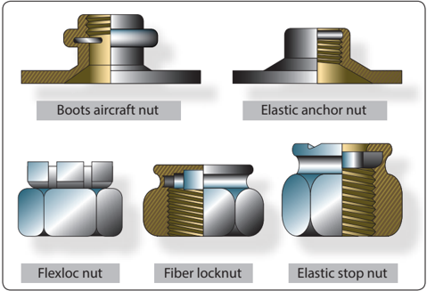
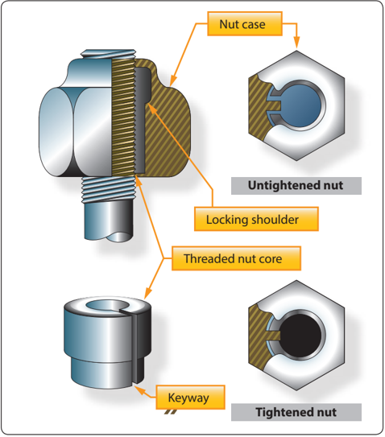

pulleys, provided the inner race of the bearing is clamped to the supporting structure by the nut and bolt. Plates must be attached to the structure in a positive manner to eliminate rotation or misalignment when tightening the bolts or screws.

The two general types of self-locking nuts currently in use are the all-metal type and the fiber lock type. For the sake of simplicity, only three typical kinds of self-locking nuts are considered in this handbook: the Boots self-locking and the stainless  steel  self-locking  nuts,  representing  the  all-metal types; and the elastic stop nut, representing the fiber insert type.

## Boots Self-Locking Nut

The  Boots  self-locking  nut  is  of  one  piece,  all-metal construction designed to hold tight despite severe vibration. Note in Figure 7-26 that it has two sections and is essentially two nuts in one: a locking nut and a load-carrying nut. The two sections are connected with a spring, which is an integral part of the nut.

The spring keeps the locking and load-carrying sections such a distance apart that the two sets of threads are out of phase or spaced so that a bolt, which has been screwed through the load-carrying section, must push the locking section outward against the force of the spring to engage the threads of the locking section properly.

The spring, through the medium of the locking section, exerts a constant locking force on the bolt in the same direction as a force that would tighten the nut. In this nut, the load-carrying section has the thread strength of a standard nut of comparable size, while the locking section presses against the threads of the bolt and locks the nut firmly in position. Only a wrench applied to the nut loosens it. The nut can be removed and reused without impairing its efficiency.

Boots self-locking nuts are made with three different spring styles and in various shapes and sizes. The wing type that is

Figure 7-26. Self-locking nuts.

the most common ranges in size for No. 6 up to  1 / 4 inch, the Rol-top ranges from  1 / 4 inch to 1 / 6 inch, and the bellows type ranges in size from No. 8 up to 3 / 8 inch. Wing-type nuts are made of anodized aluminum alloy, cadmium-plated carbon steel, or stainless steel. The Rol-top nut is cadmium-plated steel, and the bellows type is made of aluminum alloy only.

.

## Stainless Steel Self-Locking Nut

The stainless steel self-locking nut may be spun on and off by hand as its locking action takes places only when the nut is seated against a solid surface and tightened. The nut consists of two parts: a case with a beveled locking shoulder and key and a thread insert with a locking shoulder and slotted keyway. Until the nut is tightened, it spins on the bolt  easily,  because  the  threaded  insert  is  the  proper  size for the bolt. However, when the nut is seated against a solid surface and tightened, the locking shoulder of the insert is pulled downward and wedged against the locking shoulder of the case. This action compresses the threaded insert and causes it to clench the bolt tightly. The cross-sectional view in Figure 7-27 shows how the key of the case fits into the slotted keyway of the insert so that when the case is turned, the threaded insert is turned with it. Note that the slot is wider than the key. This permits the slot to be narrowed and the insert to be compressed when the nut is tightened.

## Elastic Stop Nut

The elastic  stop  nut  is  a  standard  nut  with  the  height increased  to  accommodate  a  fiber  locking  collar.  This

Figure 7-27. Stainless steel self-locking nut.

